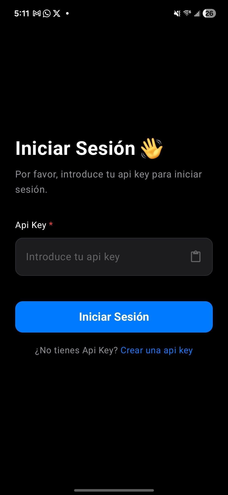
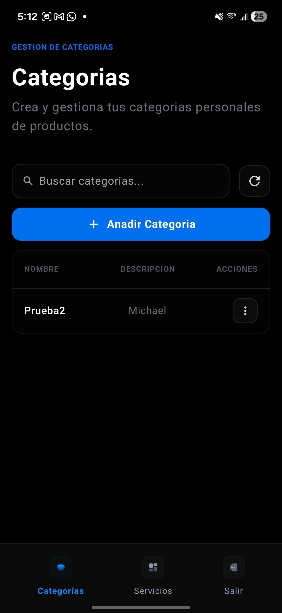
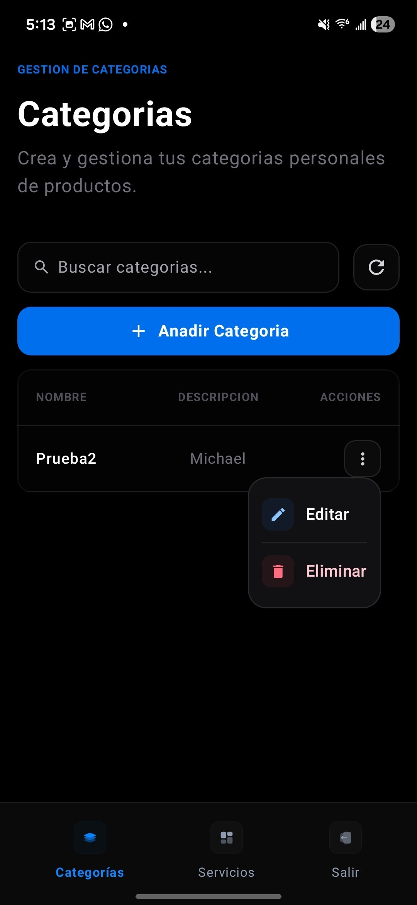
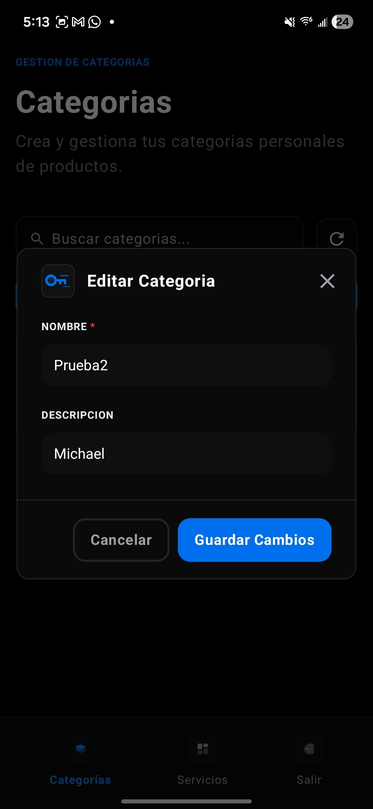
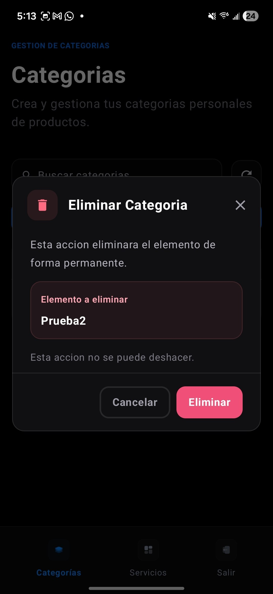
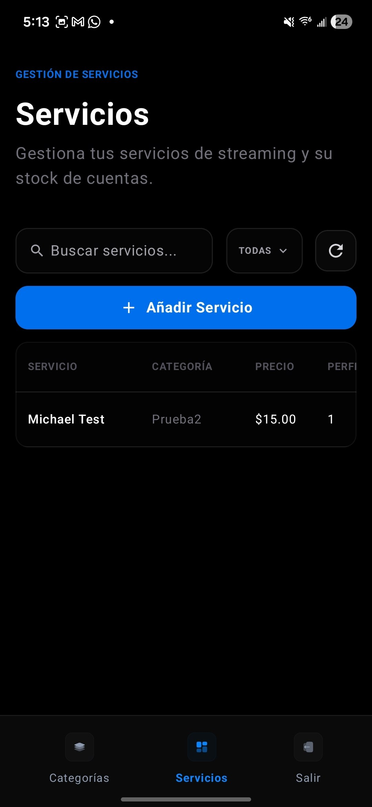
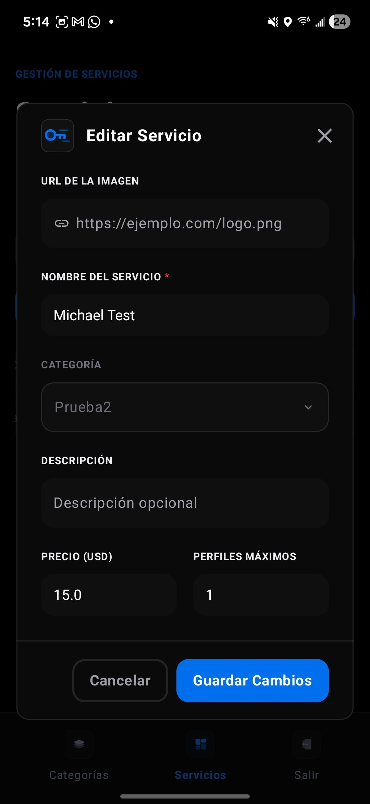
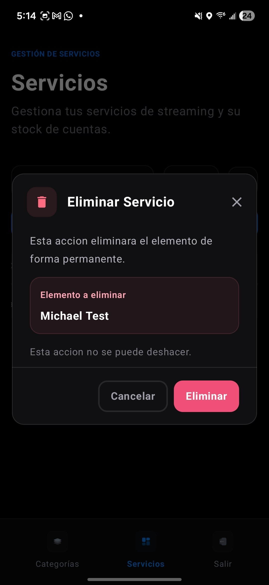
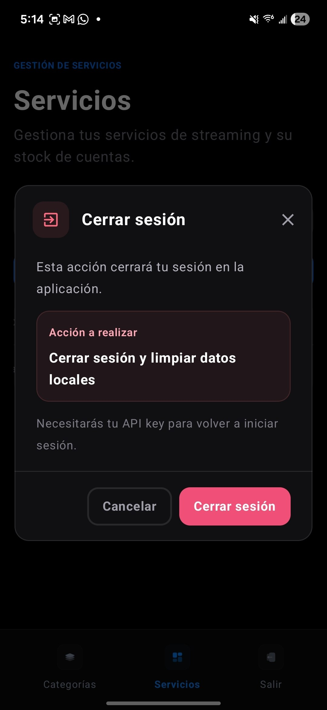

  

# KeyStream 🎵🔑

KeyStream es una aplicación móvil desarrollada en Android para la gestión segura y moderna de KeyStream, un SaaS en línea, pensada para facilitar la administración y sincronización de credenciales y accesos en diferentes dispositivos.

## 🚀 Características principales

- **Gestión de llaves y servicios:** Guarda, organiza y accede a tus llaves y servicios de forma centralizada y segura.
- **Sincronización Offline-First:** Funciona sin conexión y sincroniza automáticamente los datos locales con el servidor cuando hay internet.
- **Seguridad:** Uso de cifrado y almacenamiento seguro con Android Security y Room.
- **Interfaz moderna:** Construida con Jetpack Compose y Material Design 3.
- **Navegación intuitiva:** Basada en Navigation Compose y arquitectura MVVM.

## 🏗️ Tecnologías y Arquitectura

- **Lenguaje:** [Kotlin](https://kotlinlang.org/)
- **UI:** [Jetpack Compose](https://developer.android.com/jetpack/compose) (Material Design 3)
- **Persistencia local:** Room Database
- **Red y API:** Retrofit 2 & OkHttp
- **Inyección de dependencias:** Koin
- **Arquitectura:** Clean Architecture + MVVM
- **Seguridad:** AndroidX Security Crypto

## 📱 Capturas de pantalla

  
  
  
  
  
  
  
  
  

## ⚡ Instalación y ejecución

1. Clona el repositorio.
2. Abre el proyecto en Android Studio.
3. Sincroniza las dependencias y ejecuta la app en un emulador o dispositivo físico.

## 👨‍💻 Autor

Michael Jose Vasquez 
Estudiante de Ingeniería de Sistemas - UCNE 🇩🇴

---
